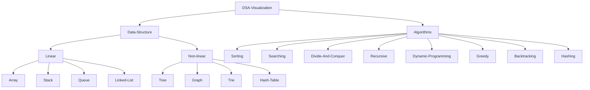

# DSA-visualization
👋
A Data Structure and Algorithms (DSA) visualization project visually represents how various data structures (e.g., arrays, linked lists, trees) and algorithms (e.g., sorting, searching) work. By creating interactive, animated diagrams, this project helps users understand key concepts, time complexities, and algorithmic behavior, improving learning and problem-solving skills.

## Table of Contents

# Connect with ~ Manthru
