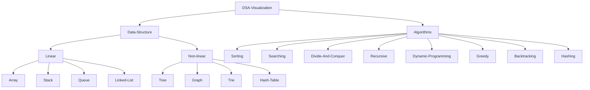

# DSA-visualization
👋
A Data Structure and Algorithms (DSA) visualization project visually represents how various data structures (e.g., arrays, linked lists, trees) and algorithms (e.g., sorting, searching) work. By creating interactive, animated diagrams, this project helps users understand key concepts, time complexities, and algorithmic behavior, improving learning and problem-solving skills.

_If you like this project, please leave me a star._ &#9733;

## Table of Contents

### Data Structures
  - **Linear Data Structures**
    - Array
    - Matrix
    - Stack
    - Queue
    - Linked List
  - **Non-linear Data Structures**
    - Tree
    - Graph
    - Trie
    - Hash Table
- ### Algorithms
  - **Sorting**
    - Selection Sort
    - Insertion Sort
    - Merge Sort
    - Quick Sort
    - Counting Sort
    - Radix Sort
    - Bucket Sort
    - Shell Sort
    - Heap Sort
  - **Searching**
    - Linear Search
    - Binary Search
    - Jump Search
    - Interpolation Search
    - Exponential Search
    - Fibonacci Search
  - **Divide and Conquer**
    - Merge Sort
    - Quick Sort
    - Strassen's Algorithm
    - Closest Pair of Points
    - Karatsuba Algorithm
  - **Recursive**
  - **Sliding Windows**
  - **Heap**
  - **Dynamic Programming**
  - **Greedy**
  - **Backtracking**
  - **Hashing**
  - **Randomized**

## Connect with me ~Manthru

)

)
)

 
 :heart: ***Thank you all for Forking this repository and contribute***  :heart:
